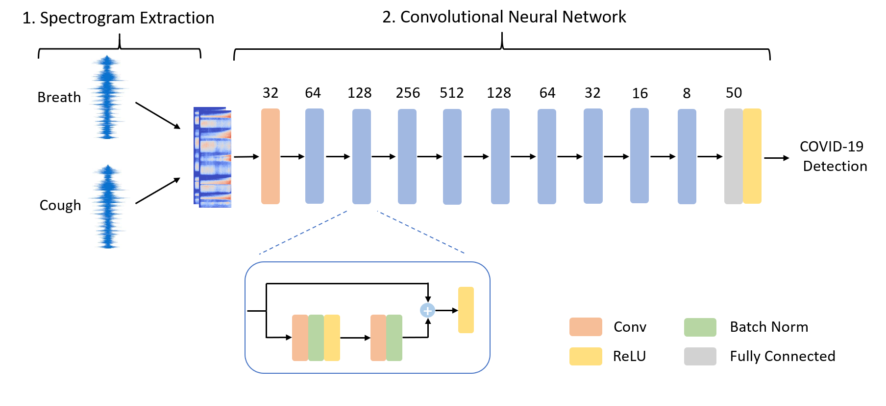

# COVID-19 Identification ResNet (CIdeR)

Repo for the classification of COVID-19 using cough and breath audio samples from [End-2-End COVID-19 Detection from Breath & Cough Audio](https://arxiv.org/pdf/2102.08359.pdf).

<figure><center><figcaption>Schematic of the CIdeR architecture</figcaption></center></figure>

## Contents:

**[main](main.py)** --> Script for orchestrating training and testing of model.\
**[data_preprocessing](data_preprocessing.py)** --> Loads and and performs all preprocessing of data.\
**[conv_model](conv_model.py)** --> code for CIdeR
**[Train/Validaiton/Test splits](paths/cross_val/)** --> The train/validation/test splits used in the paper.\
**[dev_test_train_check](dev_test_train_check.py)** --> Tests to make sure no leakage of users between train/val/test splits occurs.\
**[args](args.txt)** --> The hyperparams of the final model.\
**[create_csv](create_csv.py)** --> code used to create train/validation/test splits. *note: running this file will overwrite the splits used in this work and so if any comparision is to be made, do not run this script*

## Replication of Results
For privacy reasons we do not release the trained models however, we can provide them on request. Requests to harry.coppock@imperial.ac.uk

To train or evalute the model first install the required packages:
```sh
$ pip install -r requirements.txt
```
To train and evaluate the model with the hyperparams defined in [args.txt](args.txt) simply run:
```sh
python main.py
```
If you would like to evaluate an existing trained model:
```sh
python main.py --do_train False --saved_model_dir pathtothesavedmodel 
```


## Contributing
Please feel free to contribute to this repo:
1. Fork this repo
2. Create a branch
3. Commit and push your changes
4. Create pull request
5. Someone will review your changes and merge them.


## Questions & Issues
Create an issue and someone will respond!

## Cite

Please cite [our paper](https://arxiv.org/pdf/2102.08359.pdf)
```
@article{coppock2021end2end,
      title={End-2-End COVID-19 Detection from Breath & Cough Audio},
      author={Harry Coppock and Alexander Gaskell and Panagiotis Tzirakis and Alice Baird and Lyn Jones and Björn W. Schuller},
      year={2021},
      eprint={2102.08359},
      archivePrefix={arXiv},
      primaryClass={cs.SD}
}
```